Making Graphics With R
================
David H. Montgomery at NICAR20
3/5/2020

I’m a data journalist who makes his charts entirely in `ggplot` — no
polishing in Photoshop or Illustrator. Today I’m going to show you a lot
of my favorite tricks for taking your plots from good to great, entirely
from the command line.

Depending on your background with R, some of you probably know some of
these tricks already. That’s alright\! Hopefully everyone will come out
of this with something new and useful, and can help those around you on
those tricks you already know.

First of all, everyone should open up RStudio and create a new script or
RMarkdown document, your preference.

Now we need to load in our libraries. We’re going to use the
`tidyverse`, the collection of packages that includes `ggplot`, `dplyr`,
`tidyr`, and a host of others. We’ll also need the `scales` package.

``` r
library(tidyverse)
library(scales)
```

Now we need some charts to experiment with here. The details of what
we’re graphing don’t matter much here, so we’re going to use one of
`ggplot`’s built-in datasets, `txhousing`, and make two default graphs
to work with.

``` r
head(txhousing)
```

    ## # A tibble: 6 x 9
    ##   city     year month sales   volume median listings inventory  date
    ##   <chr>   <int> <int> <dbl>    <dbl>  <dbl>    <dbl>     <dbl> <dbl>
    ## 1 Abilene  2000     1    72  5380000  71400      701       6.3 2000 
    ## 2 Abilene  2000     2    98  6505000  58700      746       6.6 2000.
    ## 3 Abilene  2000     3   130  9285000  58100      784       6.8 2000.
    ## 4 Abilene  2000     4    98  9730000  68600      785       6.9 2000.
    ## 5 Abilene  2000     5   141 10590000  67300      794       6.8 2000.
    ## 6 Abilene  2000     6   156 13910000  66900      780       6.6 2000.

Take a look at this code, and the resulting graph, to make sure you
understand everything that’s happening here. Run it for yourself.

``` r
p <- txhousing %>% # Start with our data
    filter(city %in% c("Dallas", "Houston", "San Antonio", "Austin")) %>% # Filter it down to 4 key cities
    ggplot(aes(x = date, y = median, color = city)) + # Set our aesthetics 
    geom_line() + # Make it a line graph
    # Add our graph labels
    labs(title = "Median home price in Texas cities",
         caption = "Source: TAMU Real Estate Center. Map made for NICAR 2020.",
         y = "Median home price (dollars)",
         x = "Date",
         color = "City")
p
```

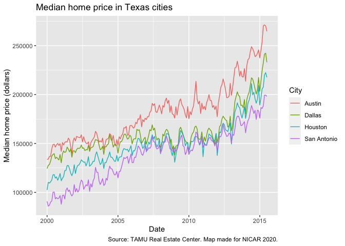<!-- -->

``` r
q <- txhousing %>%
    filter(month == 12) %>%
    filter(year %in% c(min(year), max(year))) %>%
    filter(city %in% c("Dallas", "Houston", "San Antonio", "Austin", "El Paso", "Amarillo", "Corpus Christi")) %>%
    select(city, year, sales) %>%
    spread(year, sales) %>%
    mutate(percent_change = `2014` / `2000` - 1) %>%
    ggplot(aes(x = city, y = percent_change, fill = city)) +
    geom_col() +
    labs(title = "Percent growth in Texas home sales by city",
         subtitle = "Total sales in 2014 vs. 2000.",
         caption = "Source: TAMU Real Estate Center. Map made for NICAR 2020.",
         x = "City",
         y = "Percent change",
         fill = "City")
q
```

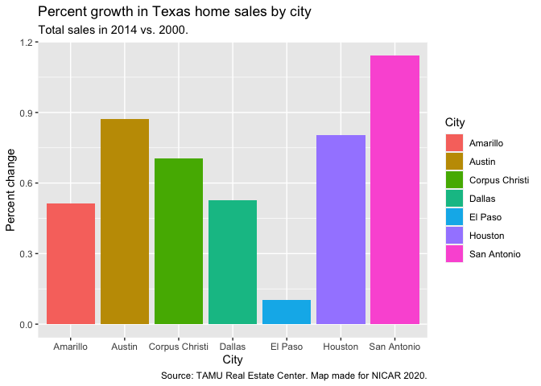<!-- -->

Now we’re going to explore some various `ggplot` tricks to see how we
can spruce this up.

## Pretty colors

For example, `ggplot`’s default color choices often leave something to
be desired. Fortunately, it includes much better color palettes derived
from [colorbrewer2.org/](http://colorbrewer2.org/).

Run `?scale_color_brewer` and scroll down in the help section to the
“Palettes” section.

We can add these various color schemes with just a single line of code.
In this case, we probably want a “qualitative” color scheme, since we
have four distinct categories we want to distinguish. I find the “Dark2”
palette often works well:

``` r
p + scale_color_brewer(palette = "Dark2")
```

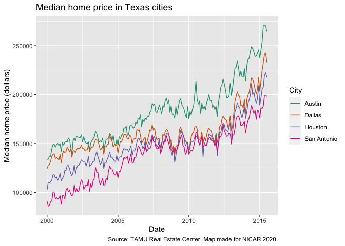<!-- -->

Try experimenting with some of the other palettes available there for a
minute.

There is also an otherwise identical function, `scale_fill_brewer()`,
for setting the fill color of bar charts and the like.

``` r
q + scale_fill_brewer(palette = "Dark2")
```

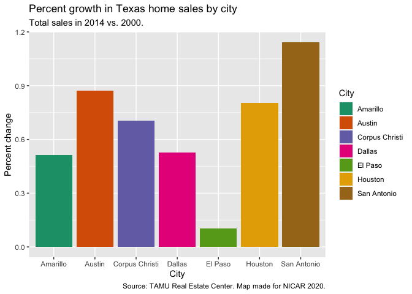<!-- -->

### Two more advanced color tricks

Let’s say you have your own color palette you want to use. That’s easy
to do in `ggplot`, with `scale_color_manual`:

``` r
p + scale_color_manual(values = c("darkred", "lightblue", "#2ca25f", "#feb24c"))
```

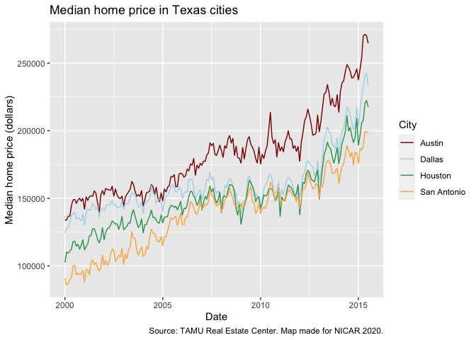<!-- -->

You’ll notice this can accept both R’s built-in color names (you can see
an exhaustive list of them
[here](chrome-extension://oemmndcbldboiebfnladdacbdfmadadm/http://www.stat.columbia.edu/~tzheng/files/Rcolor.pdf)),
or hex codes.

It can also accept R objects, which is useful if you have a regular
color palette you use over and over:

``` r
my_colors <- c("darkred", "lightblue", "#2ca25f", "#feb24c")
p + scale_color_manual(values = my_colors)
```

<!-- -->

Finally, sometimes you have color names in your data itself. That’s
where another trick, `scale_color_identity()` comes in. Here’s a
somewhat convoluted example, starting with creating a color column that
marks out any city that had less than 50% growth:

``` r
q1 <- txhousing %>%
    filter(month == 12) %>%
    filter(year %in% c(min(year), max(year))) %>%
    filter(city %in% c("Dallas", "Houston", "San Antonio", "Austin", "El Paso", "Amarillo", "Corpus Christi")) %>%
    select(city, year, sales) %>%
    spread(year, sales) %>%
    mutate(percent_change = `2014` / `2000` - 1) %>%
    mutate(color_name = ifelse(percent_change < 0.5, "darkred", "darkblue"))
q1
```

    ## # A tibble: 7 x 5
    ##   city           `2000` `2014` percent_change color_name
    ##   <chr>           <dbl>  <dbl>          <dbl> <chr>     
    ## 1 Amarillo          158    239          0.513 darkblue  
    ## 2 Austin           1330   2491          0.873 darkblue  
    ## 3 Corpus Christi    220    375          0.705 darkblue  
    ## 4 Dallas           3098   4734          0.528 darkblue  
    ## 5 El Paso           492    542          0.102 darkred   
    ## 6 Houston          3950   7125          0.804 darkblue  
    ## 7 San Antonio      1008   2161          1.14  darkblue

And graphing it. Note that I set the fill to my `color_name` column.
Then we add `+ scale_fill_identity()`.

``` r
q1 %>%
    ggplot(aes(x = city, y = percent_change, fill = color_name)) +
    geom_col() +
    scale_fill_identity() +
    labs(title = "Percent growth in Texas home sales by city",
         subtitle = "Total sales in 2014 vs. 2000.",
         caption = "Source: TAMU Real Estate Center. Map made for NICAR 2020.",
         x = "City",
         y = "Percent change",
         fill = "City")
```

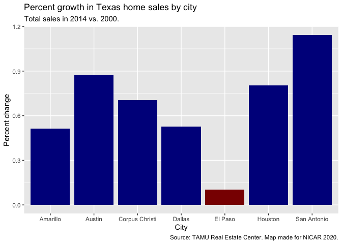<!-- -->

Finally, note that the `identity` scales suppress your legend by
default. I most often use them to distinguish between bars that are
above and below 0.

## Scales

One of the easiest things you can do to make your graph look pretty is
to adjust your scales. You do this with the `scale_` functions, such as
`scale_y_continuous` or `scale_x_discrete`. Fortunately, the `scales`
package you used makes it really easy to get pretty scales.

``` r
p + scale_y_continuous(labels = dollar)
```

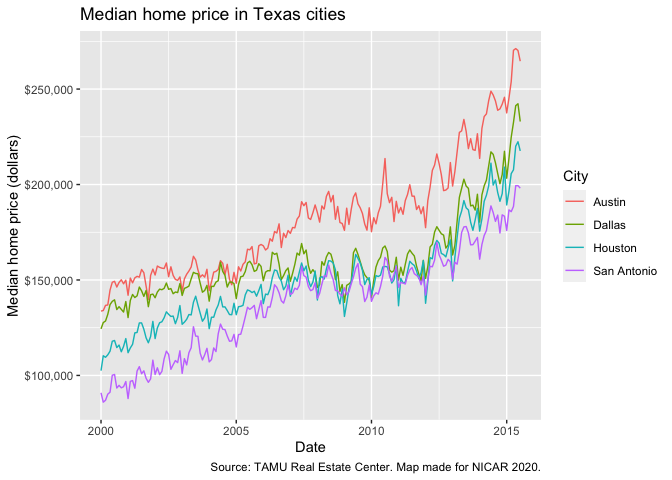<!-- -->

Voila\! Now your scales are properly formatted, with one line of code.

There are other formatters built-in to `scales`, including `comma`,
which adds thousands-separators to your scales, and `percent`, which
converts decimals into percents, like this:

``` r
q + scale_y_continuous(labels = percent) +
    labs(y = "Percent increase")
```

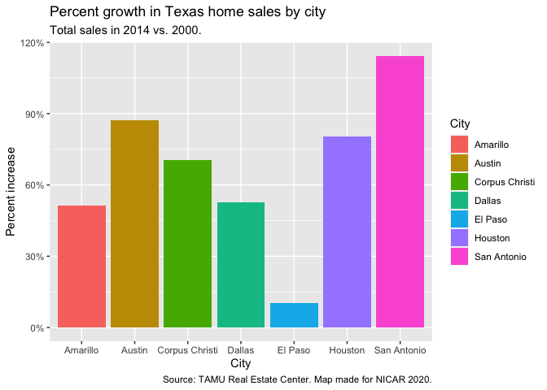<!-- -->

These formatting functions also have lots of tricks under the hood for
customizing further. For example, in our sale price graph, all the
labels were in the hundreds of thousands. Wouldn’t it be nice to clean
up those wasted zeroes?

Note that for some reason I’ve never bothered to investigate, we can’t
use the `dollar()` or `percent()` functions if we’re setting parameters
like this, but have to use `dollar_format()` or `percent_Format()`.

``` r
p + scale_y_continuous(labels = dollar_format(scale = 0.001, suffix = "K")) +
    labs(y = "Median home price")
```

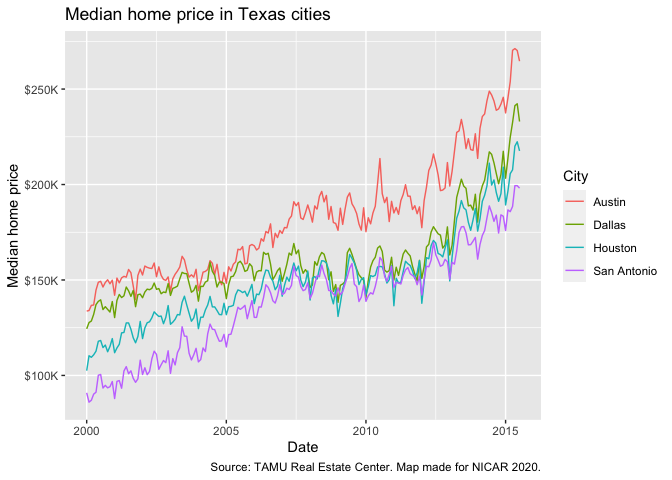<!-- -->

Another parameter you can change is `accuracy`, which determines how
many decimal points you want:

``` r
q + scale_y_continuous(labels = percent_format(accuracy = .1)) +
    labs(y = "Percent increase")
```

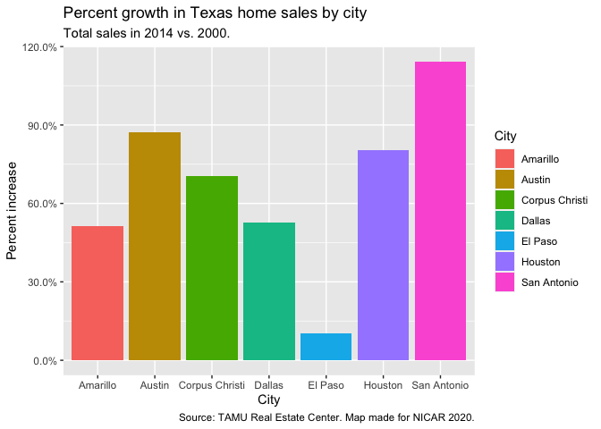<!-- -->

### Expansion

Hadley Wickham, by default, included space all around your `ggplot`
geoms. This is fine, normally, but I often don’t like bar graphs
floating in space like this:

``` r
q
```

<!-- -->

Fortunately there’s a super easy way to solve that:

``` r
q +
    scale_y_continuous(labels = percent, expand = expand_scale(mult = c(0, 0.05)))
```

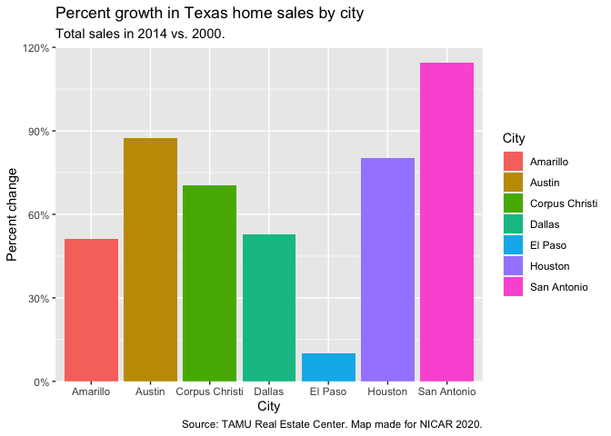<!-- -->

The `scale_*_continuous` functions take an `expand` parameter that lets
you choose how much space you want at the end of that axis. The best way
to do this is to give that parameter the argument `expand_scales()`
(which will be becoming `expansion()` in the next version of `ggplot`).

`expand_scales()` takes one of two arguments: `mult` multiplies the
space at the ends of your axis by the value(s) given, and `add` adds the
specified space. Each one can take either a single number, or a
length-two vector that specifies the values for the bottom and top (or
left and right) of the axis respectively.

The default value for `mult` is 0.05, a 5% expansion on all sides.

Here’s another look at this, expanding our x-axis:

``` r
p + scale_x_continuous(expand = expand_scale(mult = .15))
```

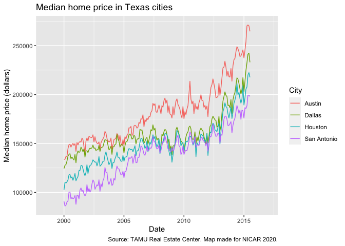<!-- -->

If we had wanted to expand just the left side, for example, we would
have done `mult = c(.15, 0)` instead.

## Themes

Under the hood, `ggplot` lets you customize essentially every detail of
your plots, using the `theme` system.

`ggplot`’s default appearance is called `theme_grey()` — a grey
background, white gridlines, and labels on the outside.

But `ggplot` also has a number of built-in themes:

  - `theme_bw()`
  - `theme_linedraw()`
  - `theme_light()`
  - `theme_dark()`
  - `theme_minimal()`
  - `theme_classic()`
  - `theme_void()`

Try adding one of them to our graphs, like this:

``` r
p + theme_minimal()
```

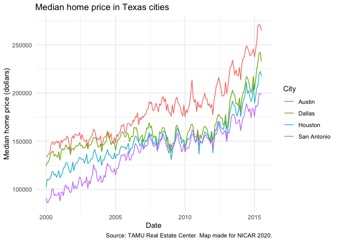<!-- -->

The `ggthemes` package also contains a bunch of extra themes, to mimic
everything from the Economist or FiveThirtyEight’s house styles to
Edward Tufte’s recommendations to a theme that mimics the charts made in
Excel 97.

## Customizing themes

You’re not limited to just using premade themes. You can modify
basically every visual element of your charts, using the `theme()`
function:

``` r
q +
    theme(legend.position = "top",
          axis.line.x = element_line(),
          panel.grid.major.x = element_blank(),
          plot.title = element_text(color = "darkred", face = "bold", size = 25))
```

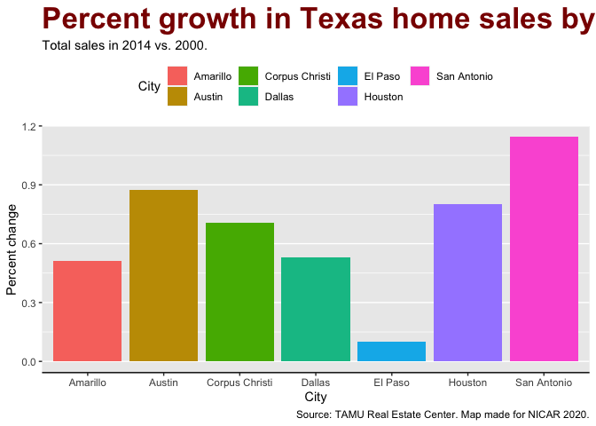<!-- -->

There are dozens of different plot elements that you can tweak, and even
after doing this for years I still have to look stuff up all the time.
[This is a good official guide to theme
elements](https://ggplot2.tidyverse.org/reference/theme.html), including
examples, but the most important thing to know is that all the theme
elements take one of several functions as their value:

  - `element_rect()`: borders and backgrounds
  - `element_line()`: lines
  - `element_text()`: text
  - `element_blank()`: removes the element

So, for example, above I set `axis.line.x` equal to `element_line()`,
which drew a line along the X axis. I set `plot.title` to
`element_text()` and also gave it some parameters for color, font size
and font face. And I removed the vertical gridlines by setting
`panel.grid.major.x` to `element_blank()`.

Parameters follow a consistent naming pattern: you can set
`axis.line.x`, `axis.title.y`, `axis.ticks.x.top` and so on.

In general, you can use `theme()` parameters to customize your plot’s

  - axes
  - legends (`legend.position`, `legend.text`, `legend.direction`, etc.)
  - labels (`plot.title`, `plot.subtitle`, `plot.caption`)
  - facets (`strip.text`, `strip.background`, `strip.placement`)
  - plot background (`panel.background`, `panel.grid.major`,
    `panel.border`)

Look again at the full list of parameters
[here](https://ggplot2.tidyverse.org/reference/theme.html), which also
tells you which `element_` function it needs.

Let’s take a few minutes and experiment with what we can do.

## Creating your own theme

At some point, you’ll settle on a collection of `theme()` elements that
you like, either for personal preference, or implementing your company’s
visual style.

For the sake of example, let’s say it’s this:

``` r
p +
    theme(plot.background = element_rect(fill = "grey20"),
        panel.background = element_rect(fill = "grey80"),
        panel.border = element_rect(fill = NA, color = "white", size = 2),
        panel.grid.minor = element_blank(),
        plot.title = element_text(color = "white", face = "bold", size = 20),
        plot.subtitle = element_text(color = "white"),
        plot.caption = element_text(color = "white", face = "italic"),
        axis.text = element_text(color = "white"),
        axis.text.x = element_text(angle = 30, vjust = 1, hjust = 1),
        axis.title = element_text(color = "white"),
        legend.text = element_text(color = "white", size = 10),
        legend.title = element_text(color = "white", size = 15),
        legend.background = element_rect(fill = NA, color = "white", size =.1),
        legend.key = element_blank())
```

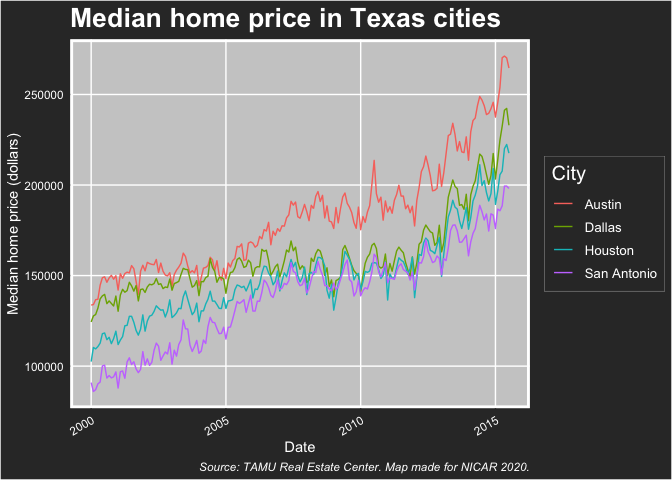<!-- -->

But it’d be really annoying to have to paste the same dozen-line
`theme()` block into each plot I make. This is code, surely there’s a
way to automate this?

Indeed there is. You write a function.

``` r
theme_nicar <- function() {
    theme_grey() %+replace% # Use theme_grey() as our default
        # Add our custom theme
        theme(plot.background = element_rect(fill = "grey20"),
              panel.background = element_rect(fill = "grey80"),
              panel.border = element_rect(fill = NA, color = "white", size = 2),
              panel.grid.minor = element_blank(),
              plot.title = element_text(color = "white", face = "bold", size = 20, margin = margin(b = 5)),
              plot.subtitle = element_text(color = "white"),
              plot.caption = element_text(color = "white", face = "italic"),
              axis.text = element_text(color = "white"),
              axis.text.x = element_text(angle = 30, vjust = 1, hjust = 1, margin = margin(t = 2, b = 4)),
              axis.title = element_text(color = "white"),
              legend.text = element_text(color = "white", size = 10),
              legend.title = element_text(color = "white", size = 15),
              legend.background = element_rect(fill = NA, color = "white", size =.1),
              legend.key = element_blank())
}
```

Basically we create a function that includes all the theme elements you
want to include. `ggplot` even lets you start with another theme as your
base, so you don’t have to define literally everything manually.

(Notice that I added a couple of `margin` parameters to some of my
`element_text()` functions, because creating a theme seems to have
overwritten `theme_grey()`’s margins. The `margin` parameter is defined
using `margin()`, which takes `t`, `b`, `l` and `r` arguments, as well
as a `unit`, which defaults to “pt”.)

Once we’ve run that function into our environment, customizing our graph
is as simple as…

``` r
p + theme_nicar()
```

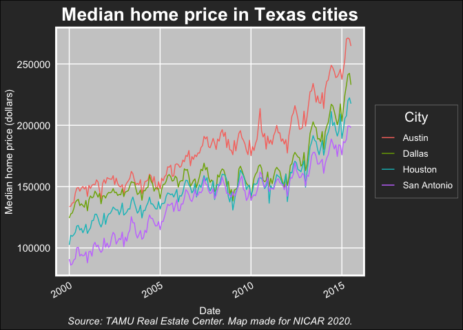<!-- -->

Note that `theme()` can’t control any data elements in your graph —
things that you’d set via `geom_` or `scale_` functions, for example.
Those you have to set manually each time.

(One side note about another handy `ggplot` function, `coord_flip()`,
which produces a graph rotated nicely 90 degrees. When using
`coord_flip()` the “y” axis is horizontal, but `scale_y_continuous()`
still controls it. However, `theme()` ignores data and looks only at the
image as a whole: `axis.text.x` will always control the horizontal
labels, regardless of whether the `x` or `y` aesthetic is on the
horizontal axis.)

Finally, let’s bring it all together:

``` r
p + 
    scale_color_brewer(palette = "Dark2") +
    scale_y_continuous(labels = dollar_format(scale = 0.001, suffix = "K")) +
    labs(y = "Median home price") +
    theme_nicar() +
    theme(axis.title.x = element_blank())
```

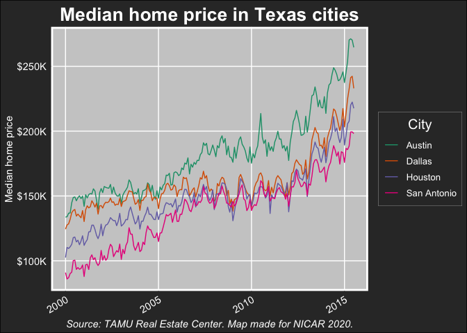<!-- -->

### About me

  - David H. Montgomery, data journalist with MPR News out of St. Paul,
    Minnesota.
  - @dhmontgomery on Twitter and just about everywhere else, including
    News Nerdery and Lonely Coders Club
  - I also host a history podcast, [*The Siècle*](http://thesiecle.com),
    about French history in between Napoleon and World War I
